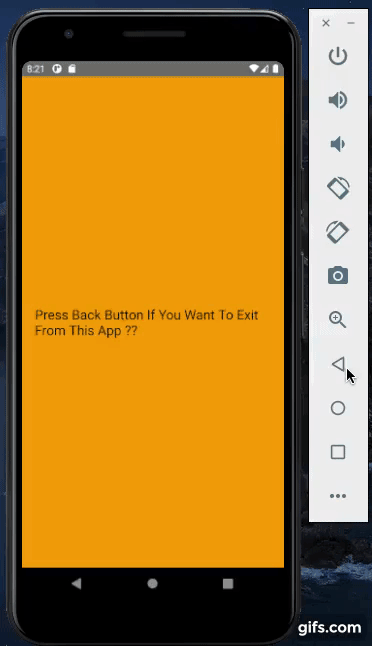
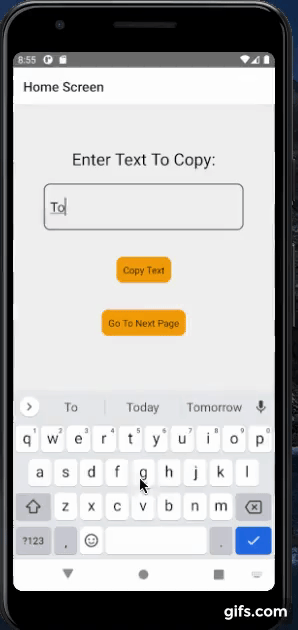
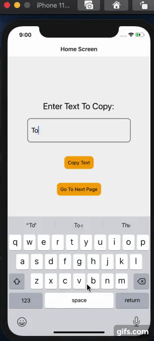

 React Native Assignment

QUES:1 Use Alert, intercept Back Press and show the text to confirm go back.

Sol: BackPressExample.js

QUES:2 Use Clipboard to move text from one screen to another.

Sol: ClipboardExample.js

In Android

In Ios

