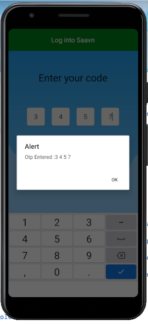
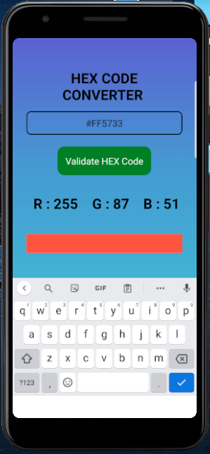
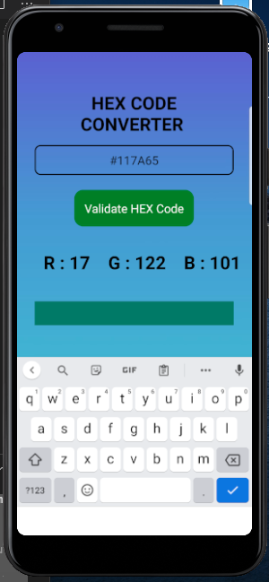
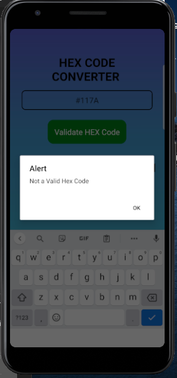

 React Native Assignment 3

Ques1: Create the screen with design given in the link below alongwith background  image.
      https://drive.google.com/file/d/1ot21Mo6zOgiY1gkDPyLw82FKe82eSXws/view?  usp=sharing

Solution : Otpscreen.js

Ques 2: Create a text input , text and view alongwith the following steps:-
     You will input the hex code of a color, and validate that hexcode on submit.
      If it is a valid hex code convert it into RGB and show its value in the Text
      Give that RGB value as background color for the View.

Solution : HexToRgb.js

Ques 3: Create a image view and show activity indicator in place of image while it is loaded.

Solution : ImageLoader.js
 

Change index.js file accordingly