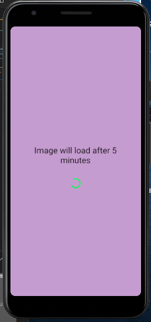

 React Native Assignment

 Create a text input , text and view alongwith the following steps:-
     You will input the hex code of a color, and validate that hexcode on submit.
      If it is a valid hex code convert it into RGB and show its value in the <Text> 
      Give that RGB value as background color for the <View>.
      

    
    
    

 Create a image view and show activity indicator in place of image while it
     is loaded.

    
    

