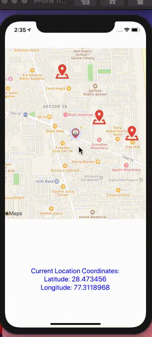

 React Native Components -6

Create a draggable ball as per demonstrated in the attached link
https://drive.google.com/file/d/1Lb53IDtVZg49MsaY1ZEX_HBJWBLhfHmD/view?usp=sharing

Create a map view
1.  Show your current location 
2. Set your current location on drag i.e,  current location functionality in zomato application.
3. Create an array of some static coordinates and show marker for those coordinates on map view.

