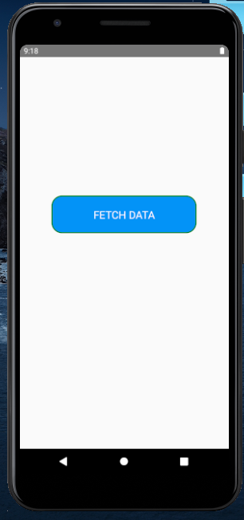
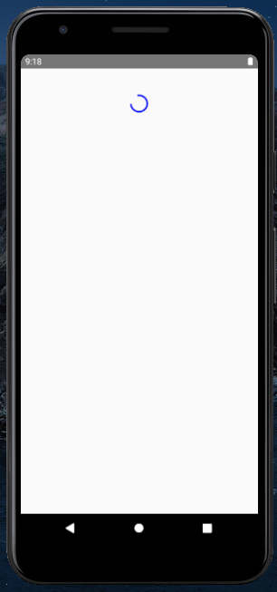

React-Native Debugging Assignment

Question: Create a new Screen 

Add a button FETCH Data
On click present a loader and make an API call 
List the data on the same screen, existing button and loader should be removed

Solution: FetchData.js

